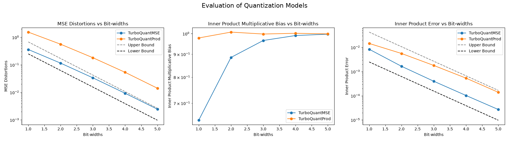
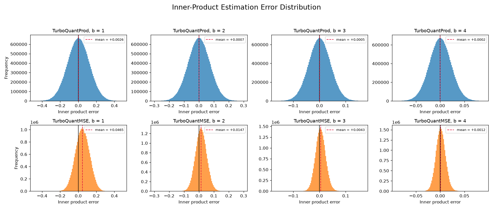
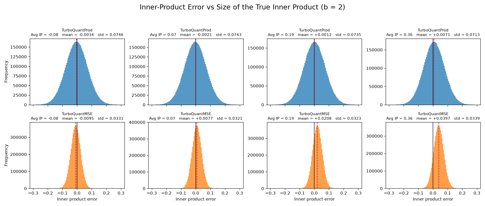
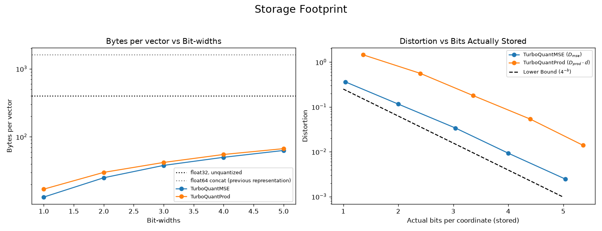

# Turbo Quant Educational Implementation

This repo contains an ongoing implementation of the Turbo-Quant quantization algorithm, with educational purposes.

References:

- [Turbo Quant Paper](https://arxiv.org/abs/2504.19874)
- [QJL Paper](https://arxiv.org/abs/2406.03482)
- [Polar Quant Paper](https://arxiv.org/abs/2502.02617)
- [RabitQ Paper](https://arxiv.org/abs/2405.12497)
- [RabitQ vs TurboQuant](https://arxiv.org/abs/2604.19528)

### What is implemented

- **`TurboQuantMSE`** (paper's Algorithm 1) — apply a random rotation, then quantize
  each coordinate independently with a Lloyd-Max scalar quantizer built for the
  marginal density of a coordinate of a uniform point on the sphere,
  `f(x) ∝ (1 - x²)^((d-3)/2)`.
- **`TurboQuantProd`** (paper's Algorithm 2) — `TurboQuantMSE` at `b-1` bits, then a
  1-bit QJL sketch of the residual together with the residual's L2 norm. Unbiased for
  inner-product estimation.

### Usage

```bash
cd src && uv run python evals.py
```

The GloVe sample is downloaded once and cached under `src/.cache/`. This writes
three figures into `src/`: `eval_turboquant.png`, `error_distribution.png` and
`error_vs_inner_product.png`.

### Results

5000 unit-normalised GloVe-6B-100d vectors (`d = 100`), averaged over 5 fixed seeds.

**`D_mse` — Theorem 1, `TurboQuantMSE`**

| b | lower bound | measured | upper bound | paper §1.3 |
|---|---|---|---|---|
| 1 | 0.25000 | **0.36090** | 0.68017 | 0.36 |
| 2 | 0.06250 | **0.11561** | 0.17004 | 0.117 |
| 3 | 0.01562 | **0.03383** | 0.04251 | 0.03 |
| 4 | 0.00391 | **0.00929** | 0.01063 | 0.009 |
| 5 | 0.00098 | **0.00245** | 0.00266 | — |

**`D_prod · d` — Theorem 2, `TurboQuantProd`**

| b | lower bound | measured | upper bound | paper §1.3 |
|---|---|---|---|---|
| 1 | 0.250 | **1.453** | 4.274 | 1.57 |
| 2 | 0.062 | **0.560** | 1.068 | 0.56 |
| 3 | 0.016 | **0.179** | 0.267 | 0.18 |
| 4 | 0.004 | **0.054** | 0.067 | 0.047 |
| 5 | 0.001 | **0.014** | 0.017 | — |

Multiplicative bias of the inner-product estimate confirms the two-stage design:
`TurboQuantProd` stays flat at 0.978–1.008 across all bit-widths, while
`TurboQuantMSE` climbs 0.641 → 0.997 as its bias shrinks with `b`.

### Memory footprint

`quantize` emits exactly `bit_width` bits per coordinate — the bit-width the paper's
`b` refers to — using the primitives in [`src/packing.py`](src/packing.py). There is no
separate packing step to remember, so `codes.nbytes` is the real number. Bytes per
vector, against a float32 baseline of 400:

| b | `TurboQuantMSE` | bits/coord | vs float32 | `TurboQuantProd` | idx | signs | norm | bits/coord | vs float32 |
|---|---|---|---|---|---|---|---|---|---|
| 1 | **13** | 1.04 | 30.8× | **17** | 0 | 13 | 4 | 1.36 | 23.5× |
| 2 | **25** | 2.00 | 16.0× | **30** | 13 | 13 | 4 | 2.40 | 13.3× |
| 3 | **38** | 3.04 | 10.5× | **42** | 25 | 13 | 4 | 3.36 | 9.5× |
| 4 | **50** | 4.00 | 8.0× | **55** | 38 | 13 | 4 | 4.40 | 7.3× |
| 5 | **63** | 5.04 | 6.3× | **67** | 50 | 13 | 4 | 5.36 | 6.0× |

`TurboQuantProd` returns a `ProdCodes` named tuple — packed indices, packed QJL signs,
and one float32 residual norm — mirroring Algorithm 2's `output: (idx, qjl, ‖r‖₂)`.
Overhead above the nominal `b·d` bits is the norm (0.32 bits/coord at d = 100) plus
byte alignment (≤ 0.04). At b = 1 the index array is genuinely empty: the `b−1 = 0` bit
MSE stage has a single centroid at the origin and carries no information.

A uint8 array still appears inside `quantize`, because `np.packbits` consumes uint8 —
but it is a local intermediate, never the stored representation. For reference, the
earlier `np.concat` into float64 cost 1608 bytes/vector, four times *larger* than the
unquantized input.

The one lossy step is storing `‖r‖₂` in float32, worth at most `1.9e-08` of
reconstruction error — seven orders of magnitude below the quantization distortion, and
consistent with the paper (§1.3 stores L2 norms in floating point). Distortions are
unchanged to five decimals by the switch to packed codes.

**Cost.** Packing sits in the hot path, so `dequantize` now unpacks on every call —
25 ms per 5000 vectors for `TurboQuantMSE` and 39 ms for `TurboQuantProd` at b = 5,
against 2.5 ms when codes were held unpacked. The full eval still runs in ~20 s.

### Reading the metrics

The two distortions (paper Eqs. 1–2) are **expectations over the quantizer's own
randomness**, for a single fixed vector and a single fixed pair:

```
D_mse  = E_Q[ ‖x − Q⁻¹(Q(x))‖² ]
D_prod = E_Q[ |⟨y,x⟩ − ⟨y, Q⁻¹(Q(x))⟩|² ]
```

Two consequences that are easy to get wrong when reproducing the figures:

- They are **means, not maxima**. Because the rotation is data-oblivious, `E_Q` is
  identical for every unit vector, so averaging over the dataset just supplies more
  Monte-Carlo samples of the same quantity. A max over the dataset estimates a tail
  quantile instead, which no theorem bounds — it exceeds the upper bound from `b = 2` up.
- `D_prod` is **per pair**, not per query. Summing the squared errors across a query's
  whole row inflates it by a factor of `n`.

**Scope of the theorems.** Theorem 1 bounds `D_mse` for `TurboQuantMSE` only; Theorem 2
bounds `D_prod` for `TurboQuantProd` only. Each model is therefore expected to fall
outside the *other* panel's band:

- `TurboQuantProd` buys unbiasedness with MSE. From Algorithm 2, the reconstruction
  error is the residual times the QJL direction error, and `E‖u − û‖² = π/2 − 1/d`
  for `m = d` measurements, giving

  ```
  D_mse(Q_prod, b) = (π/2 − 1/d) · D_mse(Q_mse, b−1)   ≈ 17 · 4⁻ᵇ
  ```

  The paper does not state this quantity; the identity above holds to within 1.1% at
  every bit-width here. That curve is drawn on the MSE panel for reference only.
- No theorem bounds `D_prod` for `TurboQuantMSE`. That curve is descriptive: because
  the estimator is biased, its error scales with `⟨y,x⟩`, ranging over 14× across
  inner-product buckets at `b = 2` (§3.2 of the paper derives the `2/π` bias at `b = 1`).

Self-pairs `⟨xᵢ, xᵢ⟩ = 1` are excluded from the inner-product metrics: they are an
artifact of using the database as its own query set, and they sit at the maximum
possible inner product, where the biased estimator is worst.

### Figures

**Distortion vs bit-width** (paper Fig. 3) — both models against the theoretical bounds.



**Error distribution** (paper Fig. 1) — the signed inner-product error `⟨y,x⟩ − ⟨y,x̂⟩`
over all 25M off-diagonal pairs, at b = 1…4, single seed.



`TurboQuantProd` sits on zero at every bit-width — Theorem 2's unbiasedness claim made
visible. `TurboQuantMSE` is shifted, and only recentres as its bias decays with `b`:

| b | mean error, `TurboQuantProd` | mean error, `TurboQuantMSE` |
|---|---|---|
| 1 | +0.0026 | +0.0465 |
| 2 | +0.0007 | +0.0147 |
| 3 | +0.0005 | +0.0043 |
| 4 | +0.0002 | +0.0012 |

**Error vs the true inner product** (paper Fig. 2) — the same pairs at b = 2, bucketed
into quartiles of `⟨y,x⟩`.



| avg `⟨y,x⟩` in bucket | −0.08 | 0.07 | 0.19 | 0.36 |
|---|---|---|---|---|
| `TurboQuantProd` mean | −0.0034 | −0.0021 | +0.0012 | +0.0071 |
| `TurboQuantProd` std | 0.0746 | 0.0743 | 0.0735 | 0.0713 |
| `TurboQuantMSE` mean | −0.0095 | +0.0077 | +0.0208 | +0.0397 |
| `TurboQuantMSE` std | 0.0331 | 0.0321 | 0.0323 | 0.0339 |

The spread is flat across buckets for both models — what moves is the **centre**.
`TurboQuantMSE`'s mean error tracks `⟨y,x⟩` at a near-constant ratio of 0.112, 0.109,
0.112, 0.111, i.e. `1 − 0.885`, which is exactly the multiplicative bias measured in
the third panel of the first figure. It even flips sign on the negative-inner-product
bucket. `TurboQuantProd` shows no such relationship. Since `E[e²] = mean² + std²`, this
is precisely why `D_prod` grows with `⟨y,x⟩` for the MSE-optimal quantizer and stays
put for the two-stage one.

(The paper's Fig. 2 caption phrases this as the *variance* growing with the average
inner product; on this dataset the standard deviation is flat and it is the mean that
scales. The growth in total squared error is the same either way.)

**Storage footprint** — bytes per vector by representation, and distortion against the
bits *actually stored* rather than the nominal bit-width.



### TODO
- [x] evaluate errors across several fixed, reproducible seeds and average the results
- [x] validate the empirical distortions against the paper's theoretical bounds
- [x] reproduce the paper's error-distribution figures (Figs. 1 and 2)
- [ ] add an implementation of rabitQ and compare
- [x] measure memory gains (bit-packed storage in `src/packing.py`)
- [ ] measure speed overhead
