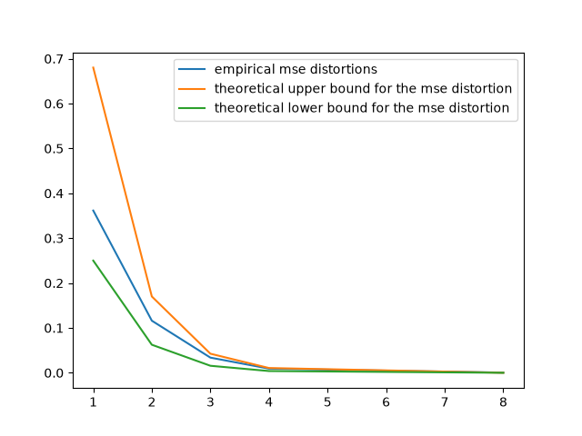

# Turbo Quant Educational Implementation

This repo contains an ongoing implementation of the Turbo-Quant quantization algorithm, with educational purposes.

References:

- [Turbo Quant Paper](https://arxiv.org/abs/2504.19874)
- [QJL Paper](https://arxiv.org/abs/2406.03482)
- [Polar Quant Paper](https://arxiv.org/abs/2502.02617)
- [RabitQ Paper](https://arxiv.org/abs/2405.12497)
- [RabitQ vs TurboQuant](https://arxiv.org/abs/2604.19528)

### Figures

### TODO
- [ ] fix: right now in the plot you see the empirical numbers are outside the theoretical bounds. 
    This needs fixing. Worth remembering that the bounds are in expectations. Hence, for a more accurate evaluation, it'd be needed to run it with several seeds, and average all that.
    Right now we're averaging over the data. Instead, we should take the worst case in the data
    and average across all seeds.
- [ ] add an implementation of rabitQ and compare
- [ ] measure memory gains
- [ ] measure speed overhead
