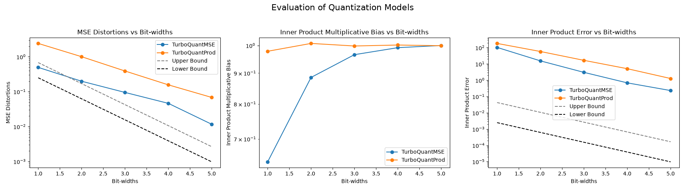

# Turbo Quant Educational Implementation

This repo contains an ongoing implementation of the Turbo-Quant quantization algorithm, with educational purposes.

References:

- [Turbo Quant Paper](https://arxiv.org/abs/2504.19874)
- [QJL Paper](https://arxiv.org/abs/2406.03482)
- [Polar Quant Paper](https://arxiv.org/abs/2502.02617)
- [RabitQ Paper](https://arxiv.org/abs/2405.12497)
- [RabitQ vs TurboQuant](https://arxiv.org/abs/2604.19528)

### Figures

### TODO
- [x] evaluate worst-case data errors across several fixed, reproducible seeds and average the results.
- [ ] add an implementation of rabitQ and compare
- [ ] measure memory gains
- [ ] measure speed overhead
